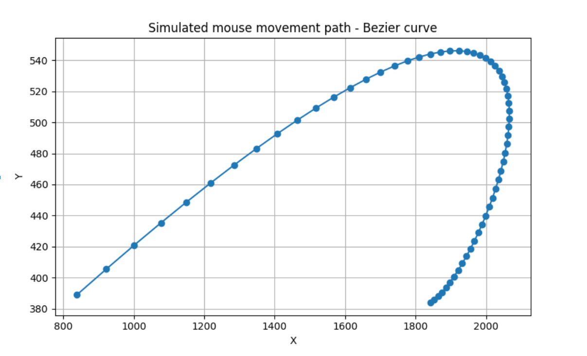
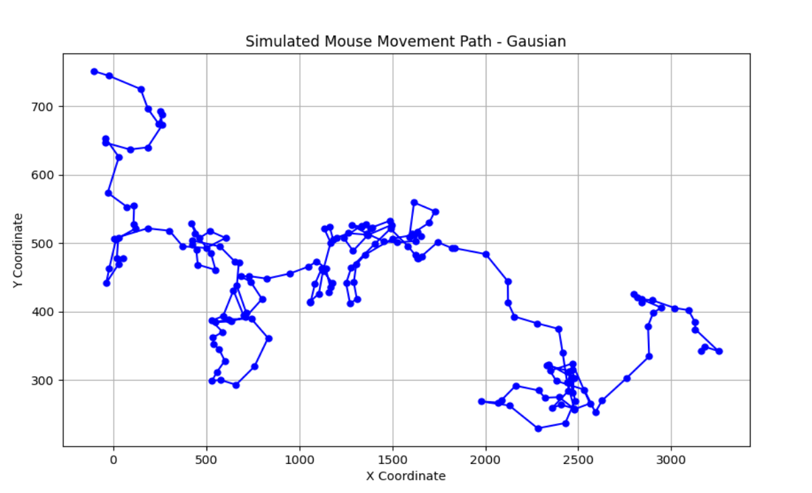
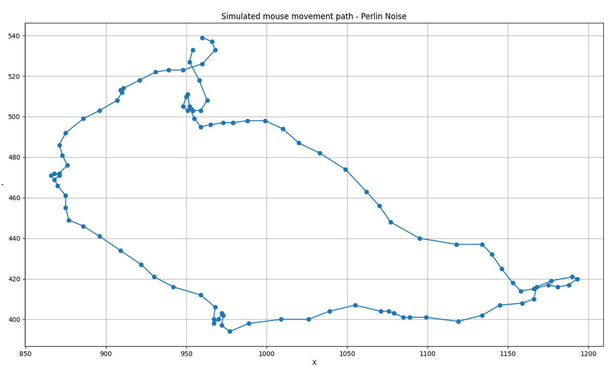

<h1 align="center">
        🐭 Oxy® Mouse
    </h1>
    <p align="center">
        <p align="center">Generate mouse movements with Python & different algorithms</p>
    </p>
<h4 align="center">
    <a href="https://discord.gg/cZZ7Bw4xN3">
        
    </a>
</h4>


OxyMouse is a Python library for generating mouse movements. 

It is designed to work with any browser control library that supports 2D moving of the mouse cursor.

## Installation

```bash
pip install oxymouse
```

## Usage

Specify `algorithm` an algorithm.

Supported algorithms:

`bezier`, `gaussian`, `perlin`

```python

from oxymouse import OxyMouse

mouse = OxyMouse(algorithm="bezier")
movements = mouse.generate_random_coordinates(viewport_width=1920, viewport_height=1080)
```


#### generate_random_coordinates

This method will generate random coordinates based on your viewport width and viewport height.


#### generate_coordinates

This method will generate random coordinates from a given 2D point to another 2D point.

You can use this to generate movements to a button.

For example:

- get button coordinates
- get current mouse coordinates
- generate movements from current mouse coordinates to button coordinates

```python
from oxymouse import OxyMouse

mouse = OxyMouse(algorithm="bezier")
movements = mouse.generate_coordinates(from_x=400, from_y=500, to_x=1000, to_y=1200)
```

#### generate_scroll_coordinates

This method will generate random coordinates for scrolling.

```python
from oxymouse import OxyMouse

mouse = OxyMouse(algorithm="bezier")
movements = mouse.generate_scroll_coordinates()
```

## Supported Algorithms

### Bezier

The Bezier algorithm generates mouse movements using the Bezier curve.
Perfect for moving to click a button



### Gaussian

The Gaussian algorithm generates mouse movements using the Gaussian distribution.
Perfect for simulating human-like mouse movements



### Perlin

The Perlin algorithm generates mouse movements using the Perlin noise.
Perfect for simulating human-like mouse movements




### Testing

You can easily test generated mouse movements visually with specific algorithm.

Use the CLI to test the generated mouse movements.

For example, to test the generated mouse movements with the `Bezier` algorithm and `generate_coordinates` function.

```bash
python3 visualize.py bezier gc
```

You will see the generated mouse movements in a window. Similar in the examples above.

Other function names:
```
function_names_to_function_map = {
    "gc": "generate_coordinates",
    "grc": "generate_random_coordinates",
    "gsc": "generate_scroll_coordinates",
}
```

## Contributing

Contributions are welcome! For feature requests and bug reports please submit an issue!